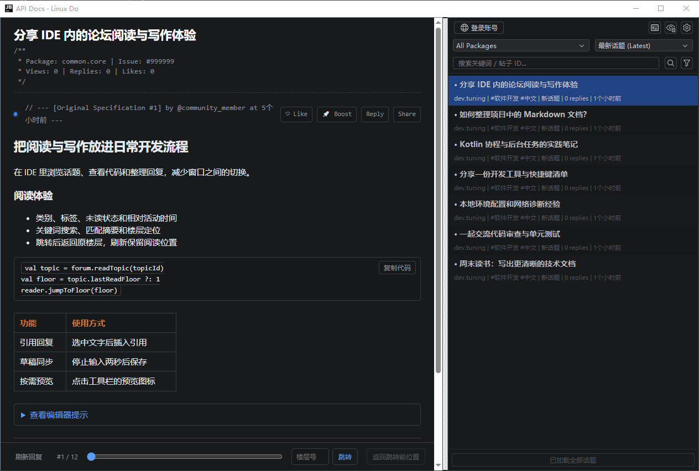
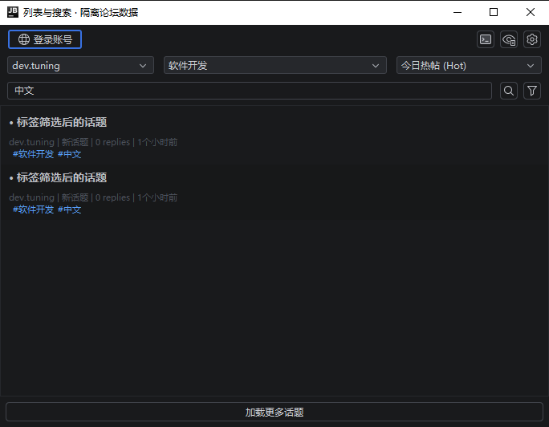
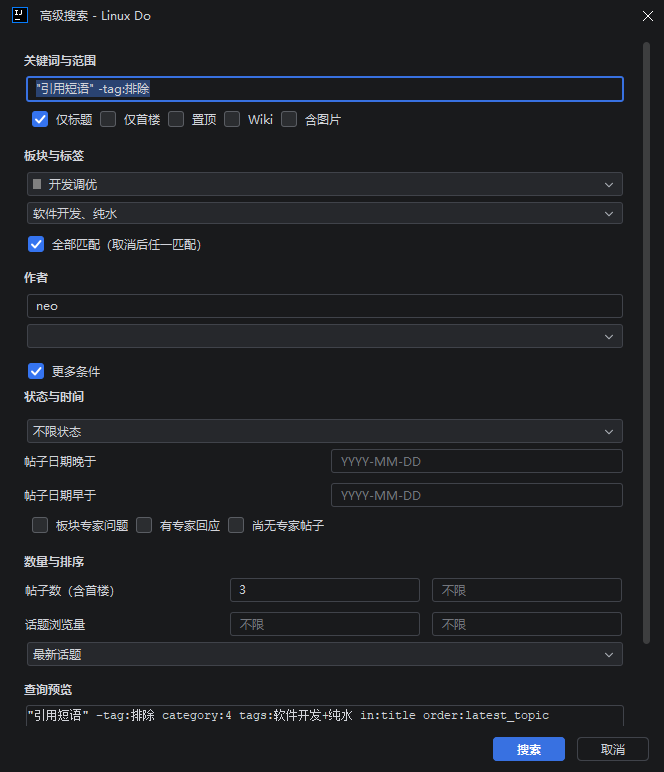
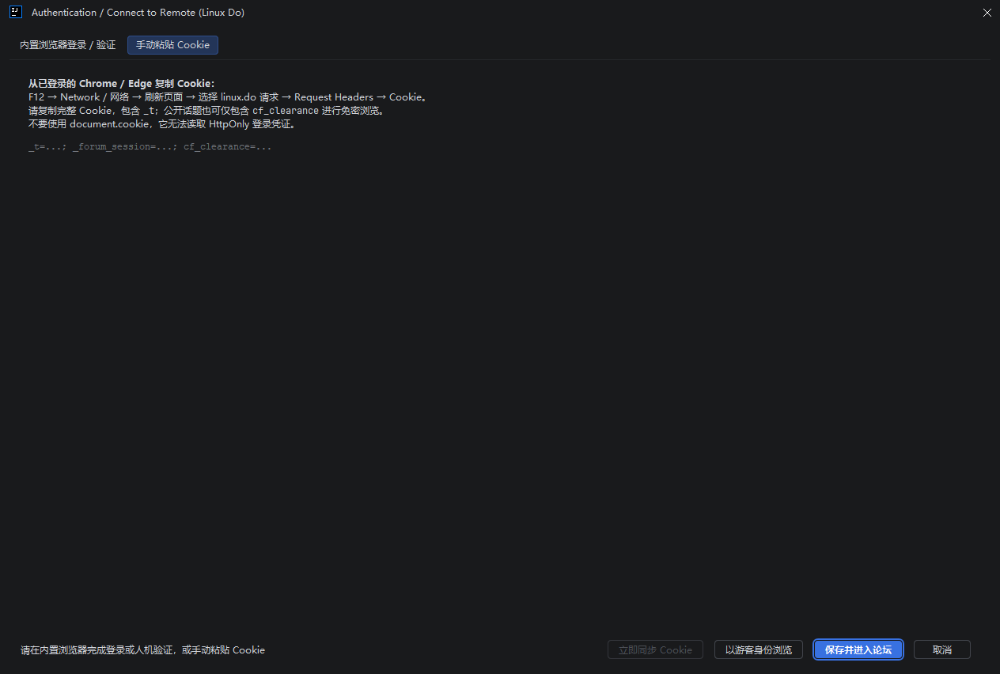
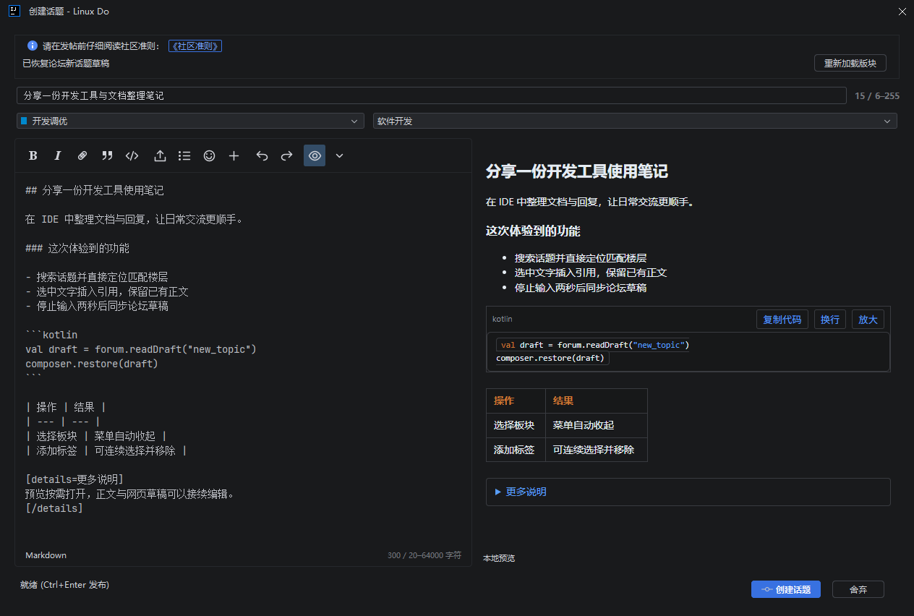
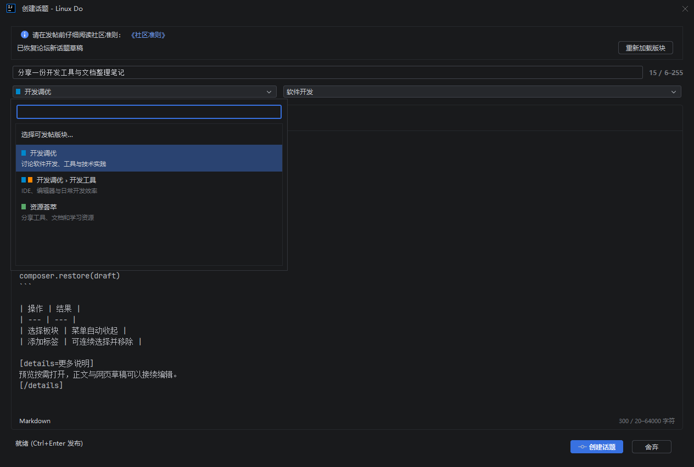
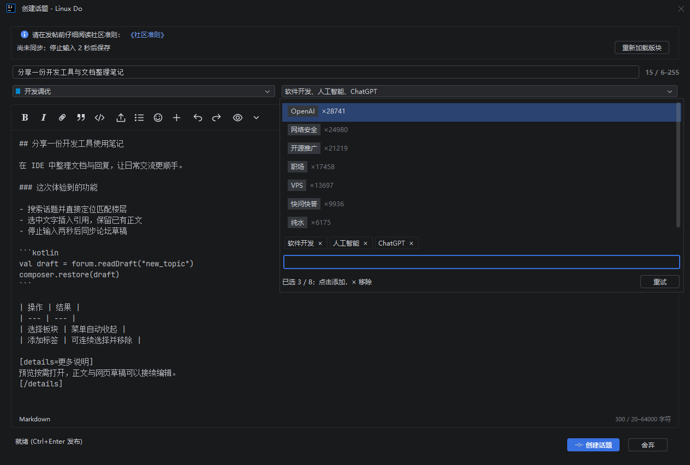
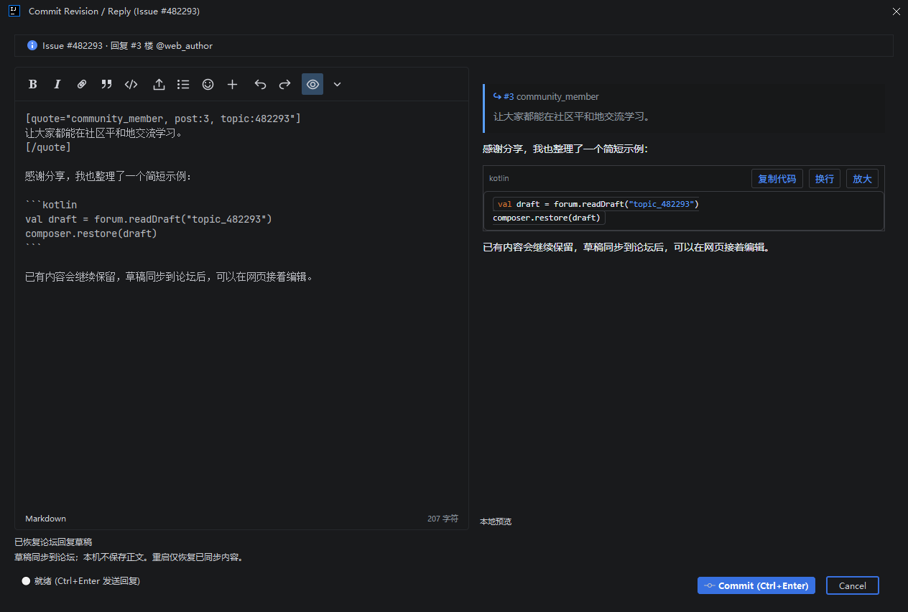
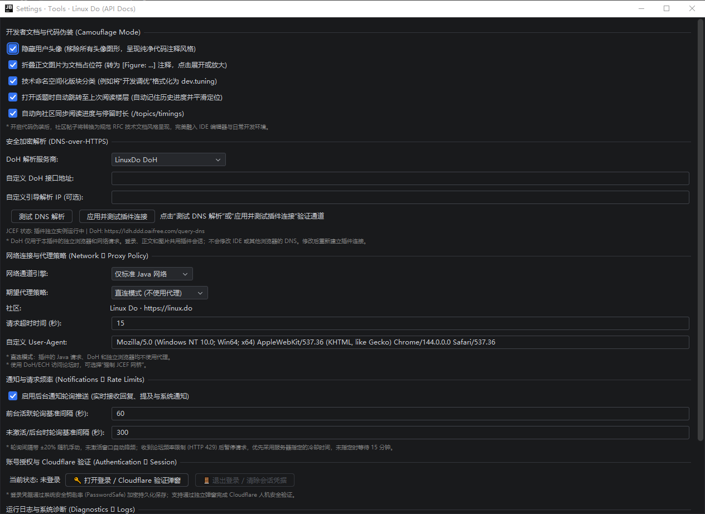

# Linux Do JetBrains Plugin

[JetBrains Marketplace](https://plugins.jetbrains.com/plugin/34669-linux-do-api-docs-) · [更新记录](CHANGELOG.md) · [隐私说明](docs/privacy.md)

由 lgguan 个人开发、采用 MIT 许可的非官方 Linux Do 客户端，与 Linux Do 官方及 JetBrains 无隶属关系。插件使用 https://linux.do 论坛接口，在 JetBrains IDE 内提供文档风格的话题列表和正文、登录、搜索、发帖与回复、通知、阅读进度和双向楼层加载。

老板键 `Alt+Shift+H` 隐藏当前项目的全部话题标签页（含分屏）与 API Docs 面板，再按一次恢复。恢复时重新加载话题并定位到记录的楼层；原分屏布局不恢复。也可在 IDE Keymap 设置中修改 Boss Key 快捷键。

列表显示分类、标签、未读状态和相对活动时间，同一筛选刷新保留已加载话题、选中项和阅读位置。关键词搜索支持“加载更多”，显示首个匹配摘要并定位到匹配楼层；纯数字或 `#ID` 仍精确查找话题。正文底部可返回跳转前楼层，已缓存楼层在请求冷却期间仍可本地导航。

板块、列表类型和单个标签可组合筛选，默认全部标签；列表里的标签也可点击。标签使用紧邻板块的原生下拉框，整块可点击展开；菜单支持搜索名称和分组，并显示论坛返回的使用数量。关键词搜索继承当前板块与标签，手写条件优先，清空搜索回到原筛选列表。

高级搜索提供标题、首楼、置顶、Wiki、图片、作者、状态、日期、帖子数与浏览量范围，标签可选择全部或任一匹配。登录后还可搜索个人行为、阅读和订阅状态，以及当前账号有权阅读的个人消息。查询可回填、重置和复制，引用短语、否定条件和未知手写语法会保留；额外的解决状态、专家筛选和票数排序随论坛设置显示。详见[搜索与标签验证记录](docs/advanced-tag-filter-verification.md)。

在同一楼层正文中选中文字可“引用回复”，引用插入编辑器光标处并保留已有内容。普通回复草稿与论坛共享，停顿 2 秒自动同步；关闭时可保存、舍弃或继续编辑，冲突需选择版本。插件不新增本机正文文件，重启恢复依赖已同步草稿；详见[隐私说明](docs/privacy.md)。

搜索框支持关键词、高级搜索语法，以及 `123456` / `#123456` 形式的帖子 ID 精确查询。纯数字关键词可加双引号进行全文搜索。新建和刷新统一放在 API Docs 标题栏。正文代码块及 HTML 源码块支持“复制代码”，保留完整缩进和换行，翻页追加的代码块同样可用。

底部导航栏提供刷新（F5）、楼层进度、直接跳转和返回跳转前位置。远距离跳转只加载目标附近内容，不会后台补抓整个长帖。普通 HTTP 429 表示论坛请求频率限制，冷却期间暂停远程读取，已加载内容仍可定位；带 Cloudflare 验证标记的响应会提示完成手动人机验证后重试。

“阅读与话题操作”菜单提供首楼、末楼、未读、帖内分页搜索、作者与热门回复筛选、正文目录、书签和通知等级。字号、行距与阅读宽度可独立调整。长帖最多保留 200 个完整楼层节点，正文缓存以 400 帖和 32 MiB 为上限；局部更新保留阅读位置、展开状态及仍存在的选中文字。

代码支持语言高亮、换行与放大；公式和 Mermaid 使用安装包内的固定版本引擎。图片支持同帖切换、缩放、拖动、原图文件复制和保存。Bilibili、YouTube 播放器需点击后加载。帖子只显示当前可用操作，正文下方用图标提供点赞、Boost 和回复，分享及其他操作收进“更多”；正文标题区域右上角的阅读工具默认收起，按当前话题状态显示有效入口，楼层定位提示与快捷调整同一行。自动已读只累计前台正文停留时间，更新蓝点和未读入口，并按设置批量同步。收藏、回应、编辑、历史、软删除、恢复、举报及投票遵循论坛返回的权限；编辑正文只保留在编辑窗口，不写入新话题或回复草稿。详见[功能支持表与验收记录](docs/post-reader-verification.md)。

楼层标题精简为编号、作者、时间与回复对象，收藏仅显示一个书签图标。正文实时跟随 IDE 外观和编辑器配色；窗口缩放时正文与已打开的菜单同步调整。登录或游客验证完成后列表刷新一次，同账号重复确认不会重复刷新。

1.0.2 的 Boost 使用楼层旁浮层和头像气泡，支持 16 个可见字符、最多 5 个表情、Enter 发送、Esc 关闭及撤回自己的 Boost。入口遵循论坛权限，失败保留输入，成功只更新当前楼层。阅读同步使用持久化补传队列，重启并恢复对应账号登录后继续上传；待同步状态和重试入口位于阅读工具中。详见[Boost 与阅读同步验收](docs/boost-read-sync-verification.md)。

1.0.2 同时修复首次打开帖子时，焦点留在话题列表或工具窗口导致小蓝点不消失的问题；已选中且前台可见的正文正常计时，无需切走再切回来。详见[首次打开已读回归](docs/first-open-read-verification.md)。

1.0.2 将楼层号和未读小蓝点移到楼层标题右侧，左侧头像紧邻用户名。小蓝点保留固定占位，标记已读后用户名与正文不移动。详见[楼层标题布局验收](docs/right-floor-metadata-verification.md)。

上述 1.0.2 功能与修复已包含在当前 1.0.3 中。历史安装包检查见[1.0.2 发布验证](docs/release-1.0.2.md)。

1.0.3 同时包含通知优化：全部／未读／已读状态筛选、每页 30 条与手动加载历史；类别仅筛选已加载内容。刷新保留选中项和滚动位置，失败可重试。角标使用账号计数，失败保留上次有效值并提示未更新。帖子正文显示且目标楼层定位成功后自动标读；网页通知可选中后手动标读，“账号全部标读”包含未加载通知。本站配置已核实 Boost 为 43，34 为指派。详见[通知验收记录](docs/notification-workflow-verification.md)。

## 界面预览

当前版本为 **1.0.3**，包含个人内容集中入口、书签管理、通知闭环、Markdown 编辑和 Boost 举报及用户资料优化。[GitHub Release](https://github.com/lgguan/linuxdo-jetbrains-plugin/releases/tag/v1.0.3) 已发布，[JetBrains Stable](https://plugins.jetbrains.com/plugin/34669-linux-do-api-docs-/versions/stable/1187229) 已审核通过。完整更新及发布状态见[更新记录](CHANGELOG.md)和[1.0.3 发布验证](docs/release-1.0.3.md)。

“论坛／我的”使用图标切换并高亮当前模块。“我的”提供话题、回复、书签和草稿四个页签，首次访问才读取，支持手动刷新与分页。话题、回复和草稿继续筛选已加载内容；书签默认搜索全部收藏，也可切换为本地筛选。草稿按实际键继续编辑，同键跨项目聚焦已有窗口；特殊类型使用网页入口。使用方法见[个人内容集中入口验收](docs/personal-content-verification.md)。内置浏览器登录页支持 Tab 和 Shift+Tab 在用户名、密码等控件间切换。

“我的 → 书签”按 Enter 或点击搜索查询名称、话题标题及正文。选中条目可编辑名称、设置或取消提醒，也可确认删除；原有提醒后处理策略会保留，提醒由论坛服务器发送。成功后各项目窗口和正文同步，书签刷新重新取得第一页，已删除条目不会被旧请求放回列表。置顶书签、特殊类型或无法完整读取设置时使用网页编辑。正文菜单的“我的书签”打开同一管理入口；Hot 列表已改用论坛 `/hot.json`。功能验证见[书签管理记录](docs/bookmark-management-verification.md)，最终安装包与发布状态见[1.0.3 发布验证](docs/release-1.0.3.md)。

以下截图来自插件在实际 IntelliJ IDEA 中运行的界面，使用示例话题与草稿展示功能。1.0.1 的正文布局及缩放修复验证见[正文验证记录](docs/browser-freeze-verification.md)。

1.0.3 补齐 Boost 举报与用户信息：点击气泡内容立即展开操作，不额外请求权限；自己的 Boost 仅显示垃圾桶删除，别人的举报入口使用话题已有权限，打开表单和提交前重新核对。直接点击头像图片查看公开资料，也可在网页查看完整资料。举报使用该 Boost 自身的权限、可用原因与独立接口，提交前确认目标和说明。失败保留输入，成功或结果未确认时阻止重复举报；正文节点和阅读位置保持。详见[Boost 操作验收](docs/boost-actions-verification.md)。

### 话题浏览

在 API Docs 面板筛选和搜索话题，编辑器以文档风格显示正文。列表展示板块、标签、未读状态和活动时间；正文支持引用、代码复制、表格、折叠内容和底部楼层导航。



板块旁的标签下拉框支持组合筛选和搜索，窄窗口自动换行。



### 高级搜索

常用条件直接显示，更多条件可展开；日期与数量错误会定位提示，底部可查看并复制完整查询。



### 登录

通过内置浏览器完成登录与 Cloudflare 验证，也可切换到手动粘贴 Cookie。凭据交由 IDE PasswordSafe 保存；截图展示空白的手动输入页。



### 创建话题

点击新建直接进入编辑器；已有论坛新话题草稿会自动恢复标题、正文、板块和标签。同一会话内，相同草稿键只打开一个编辑器；“我的草稿”可分别恢复不同新话题草稿。停止输入两秒后同步到论坛，保存失败会保留输入，冲突时可选择保留的版本。新建和回复窗口默认更宽、更高，仍可调整大小。

正文与预览支持引用、代码、表格、链接卡片、图片、折叠和隐藏内容。编辑器使用分组图标工具栏，较少使用的格式收纳在“更多”中。预览默认收起，点击眼睛图标打开本地实时预览，也可通过旁边菜单选择“论坛引擎预览”；预览不会提交帖子或保存草稿。公式、Mermaid 和投票提供内容回退或网页入口。上传中的图片会锁定发送，失败可重试或舍弃任务；发布结果未确认时保留输入，并要求先在网页检查。



1.0.3 加入 Markdown 编辑辅助：新话题、回复和编辑帖子共用格式切换、列表 Enter 续行、列表／围栏代码 Tab 缩进、带语言代码块和链接编辑。普通文本的 Tab 用于焦点导航，Control+Tab 可离开编辑区；每次辅助操作支持一次撤销。使用边界与验证说明见[编辑辅助验收](docs/markdown-editor-verification.md)。

### 选择板块与标签

板块支持搜索名称、父板块、slug 和描述，显示层级与颜色，选中后立即收起。



标签弹层参考网页版：上方显示候选标签及话题数量，中间显示已选标签块，底部输入关键词。点击候选项可连续添加，用 × 移除已选项，多个标签自动换行；数量限制与禁用提示遵循当前论坛设置。

板块与标签下拉框高度一致，标签框整块可点击；已选标签的移除操作只在菜单内显示。标签检查提示左对齐置于标签框下方，检查成功后隐藏，失败可重试。创建话题与回复窗口的编辑区、提示及已打开的预览实时跟随 IDE 外观和编辑器配色。



### 引用回复与草稿接续

选中文字后引用回复，引用会插入光标处并保留已有正文。窗口显示回复对象和楼层，使用与新话题一致的工具栏及按需预览。回复草稿可在 IDE 与网页之间接续编辑；关闭时可保存、舍弃或继续编辑。未同步内容只保留在当前窗口，重启恢复依赖已同步草稿。



## 默认网络配置

安装、更新、禁用或卸载插件后，请按 IDE 提示重启以完成操作。插件依赖的网络超时监控线程不支持即时退出，因此不支持热卸载。

默认启用 LinuxDo DoH：`https://ldh.ddd.oaifree.com/query-dns`，这是唯一内置解析服务商。设置中仍可选择“自定义 DoH 服务”或“禁用 DoH（使用系统默认 DNS）”。DoH 服务自身使用系统 DNS 引导解析；严格模式默认开启。

在 Settings → Tools → Linux Do (API Docs) 中调整阅读、网络和通知选项。详细说明见[网络配置与诊断](docs/network-diagnostics.md)。



## 开发与构建

使用 JDK 17（推荐的构建版本），在 Windows PowerShell 中执行：

```powershell
.\gradlew.bat test buildPlugin --console=plain
```

macOS / Linux：

```sh
./gradlew test buildPlugin --console=plain
```

依赖已缓存时可加 `--offline`。安装包生成在 `build/distributions/`，版本统一定义在 `build.gradle.kts`。在 IDE 的 Plugins → Install Plugin from Disk 中选择 ZIP 安装。

插件适配 Windows、macOS、Linux，使用同一 ZIP。支持的 IDE 分支为 **JetBrains 2026.2（262 至 262.*）**，需要 IDE 配套的 JBR 与已启用的 JCEF 插件；原生架构跟随宿主，支持 x64 / ARM64，不混用其他架构的浏览器库。macOS/Linux 桌面交互仍需在目标系统实测，验证方法见[跨平台适配指南](docs/cross-platform.md)。

编译 SDK 仍为 IntelliJ IDEA Community 2024.1.4（241），Java/Kotlin 字节码目标为 17；这不代表支持旧 IDE。安装限制为 262 至 262.*。Kotlin 标准库由 IDE 提供，插件不重复打包。

默认单元测试使用 headless 模式，两项系统剪贴板测试会明确跳过。有桌面会话时可使用 `-PdesktopTests=true` 启用它们；这些测试会改写系统剪贴板。三平台 CI 检查构建和单元测试，原生 JCEF 与真实 IDE 验收有独立入口。

## 目录

| 路径 | 用途 |
| --- | --- |
| `src/main/kotlin/com/lgguan/linuxdo/plugin/` | 插件源码：action、api、config、editor、model、net、service、theme、ui |
| `src/main/resources/META-INF/plugin.xml` | IDE 扩展、服务与动作注册 |
| `src/main/resources/web/` | 正文浏览器使用的脚本资源 |
| `src/test/kotlin/com/lgguan/linuxdo/plugin/` | JUnit 回归测试 |
| `tools/` | 构建校验、JCEF 与导航回归工具 |
| `docs/` | 使用、开发与发布指南 |
| `build/` | 构建输出、测试报告与本机诊断产物，已忽略 |

登录、API 网桥及正文共用插件私有 JCEF 运行时；Java 网络保留 OkHttp/DoH 路径。浏览器配置状态与连接验证结果分别记录。

## 文档与验证

- [GitHub 与 Marketplace 发布步骤](docs/publishing.md)
- [MIT 许可](LICENSE)与[依赖许可](THIRD-PARTY-NOTICES.md)
- [隐私与本地数据清理](docs/privacy.md)
- [发布检查清单](docs/release-checklist.md)及[更新记录](CHANGELOG.md)
- [网络配置与诊断](docs/network-diagnostics.md)
- [手动回归工具](tools/README.md)
- [跨平台适配与验证](docs/cross-platform.md)
- [楼层导航与回复刷新](docs/floor-navigation.md)
- [当前编辑器与选择器回归记录](docs/picker-freeze-verification.md)
- [1.0.0 截图更新、重新上传与最低 IDE 验证记录](docs/marketplace-1.0.0-refresh.md)

JUnit 测试覆盖数据处理及回归逻辑；浏览器原生渲染、实际账号会话和目标 IDE 类加载需要按工具说明单独验证。

完整二进制兼容性检查使用 `runPluginVerifier`；`verifyPlugin` 仅检查安装包结构和描述文件。可直接使用已安装的 2026.2 IDE，不下载旧版本：

```powershell
.\gradlew.bat test buildPlugin verifyPlugin '-Pkotlin.incremental=false' --rerun-tasks --offline --console=plain
.\gradlew.bat runPluginVerifier '-PverifierIdePath=C:\path\to\IntelliJ IDEA' -PverifierOffline=true --console=plain
python tools/clean-release-build.py
```

干净目录构建工具导出当前源码（包括未提交修改），离线重新运行测试和打包，并对比工作区 ZIP 的 SHA-256。记录位于 `build/release-check/`，不会修改 Git 暂存区。它验证当前源码快照的可复现性；正式发布仍应将同一源码版本纳入版本控制。

发布 ZIP 对比前使用上述全量构建命令，避免 Kotlin 增量缓存残留的内联字节码影响包内容；macOS/Linux 将 `.\gradlew.bat` 换成 `./gradlew`。
