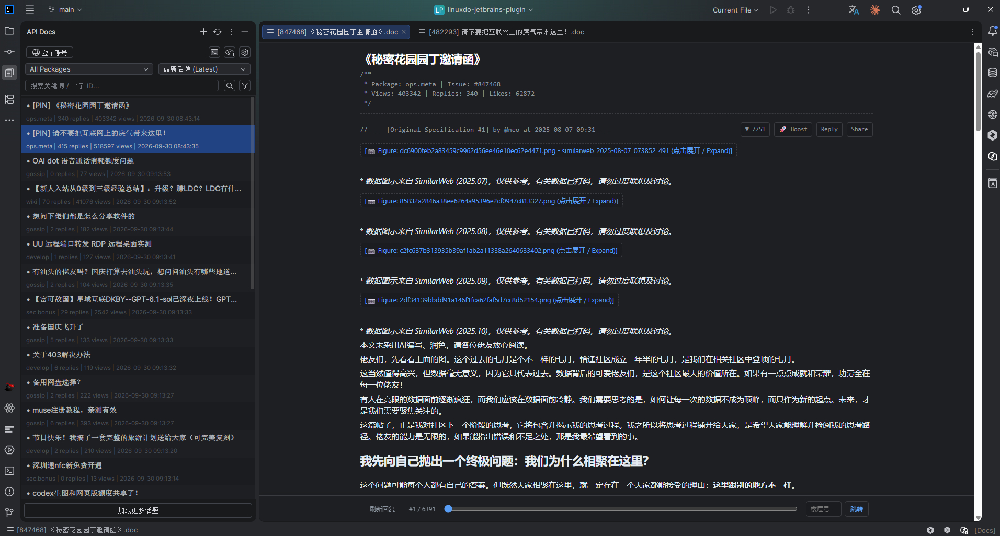
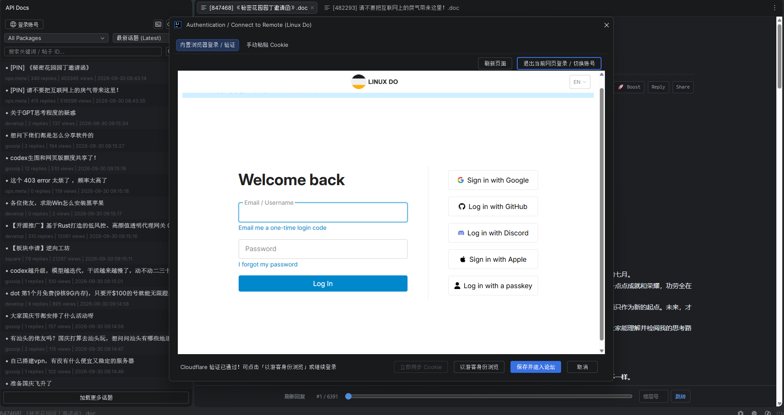
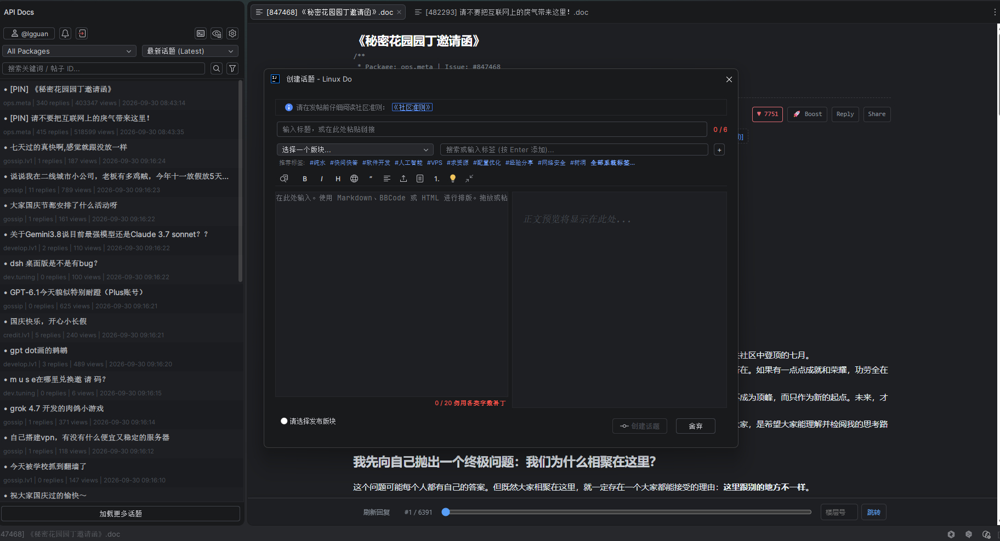

# Linux Do JetBrains Plugin

由 lgguan 个人开发、采用 MIT 许可的非官方 Linux Do 客户端，与 Linux Do 官方及 JetBrains 无隶属关系。插件仅连接 https://linux.do，在 JetBrains IDE 内提供文档风格的话题列表和正文、登录、搜索、发帖与回复、通知、阅读进度和双向楼层加载。

老板键 `Alt+Shift+H` 隐藏当前项目的全部话题标签页（含分屏）与 API Docs 面板，再按一次恢复。恢复时重新加载话题并定位到记录的楼层；原分屏布局不恢复。也可在 IDE Keymap 设置中修改 Boss Key 快捷键。

列表显示分类、标签、未读状态和相对活动时间，同一筛选刷新保留已加载话题、选中项和阅读位置。关键词搜索支持“加载更多”，显示首个匹配摘要并定位到匹配楼层；纯数字或 `#ID` 仍精确查找话题。正文底部可返回跳转前楼层，已缓存楼层在请求冷却期间仍可本地导航。

在同一楼层正文中选中文字可“引用回复”，引用插入编辑器光标处并保留已有内容。普通回复草稿与论坛共享，停顿 2 秒自动同步；关闭时可保存、舍弃或继续编辑，冲突需选择版本。插件不新增本机正文文件，重启恢复依赖已同步草稿；详见[隐私说明](docs/privacy.md)。

搜索框支持关键词、高级搜索语法，以及 `123456` / `#123456` 形式的帖子 ID 精确查询。纯数字关键词可加双引号进行全文搜索。新建和刷新统一放在 API Docs 标题栏。正文代码块及 HTML 源码块支持“复制代码”，保留完整缩进和换行，翻页追加的代码块同样可用。

底部导航栏提供刷新（F5）、楼层进度和直接跳转。远距离跳转只加载目标附近内容，不会后台补抓整个长帖；收到 HTTP 429 后显示冷却时间并暂停论坛读取，已加载内容仍可定位。

## 界面预览

### 话题浏览

左侧筛选和搜索话题，右侧以文档风格阅读正文，底部可直接跳转楼层。



### 登录

通过内置浏览器完成登录与 Cloudflare 验证，也可切换到手动粘贴 Cookie。



### 创建话题

填写标题、选择版块和标签，编辑正文并查看预览。



## 默认网络配置

安装、更新、禁用或卸载插件后，请按 IDE 提示重启以完成操作。插件依赖的网络超时监控线程不支持即时退出，因此不支持热卸载。

默认启用 LinuxDo DoH：`https://ldh.ddd.oaifree.com/query-dns`，这是唯一内置解析服务商。设置中仍可选择“自定义 DoH 服务”或“禁用 DoH（使用系统默认 DNS）”。DoH 服务自身使用系统 DNS 引导解析；严格模式默认开启。

在 Settings → Tools → Linux Do (API Docs) 中调整阅读、网络和通知选项。详细说明见[网络配置与诊断](docs/network-diagnostics.md)。


## 开发与构建

使用 JDK 17（推荐的构建版本），在 Windows PowerShell 中执行：

```powershell
.\gradlew.bat test buildPlugin --console=plain
```

macOS / Linux：

```sh
./gradlew test buildPlugin --console=plain
```

依赖已缓存时可加 `--offline`。安装包生成在 `build/distributions/`，版本统一定义在 `build.gradle.kts`。在 IDE 的 Plugins → Install Plugin from Disk 中选择 ZIP 安装。

插件适配 Windows、macOS、Linux，使用同一 ZIP。支持的 IDE 分支为 **JetBrains 2026.2（262 至 262.*）**，需要 IDE 配套的 JBR 与已启用的 JCEF 插件；原生架构跟随宿主，支持 x64 / ARM64，不混用其他架构的浏览器库。macOS/Linux 桌面交互仍需在目标系统实测，验证方法见[跨平台适配指南](docs/cross-platform.md)。

编译 SDK 仍为 IntelliJ IDEA Community 2024.1.4（241），Java/Kotlin 字节码目标为 17；这不代表支持旧 IDE。安装限制为 262 至 262.*。Kotlin 标准库由 IDE 提供，插件不重复打包。

默认单元测试使用 headless 模式，两项系统剪贴板测试会明确跳过。有桌面会话时可使用 `-PdesktopTests=true` 启用它们；这些测试会改写系统剪贴板。三平台 CI 检查构建和单元测试，原生 JCEF 与真实 IDE 验收有独立入口。

## 目录

| 路径 | 用途 |
| --- | --- |
| `src/main/kotlin/com/lgguan/linuxdo/plugin/` | 插件源码：action、api、config、editor、model、net、service、theme、ui |
| `src/main/resources/META-INF/plugin.xml` | IDE 扩展、服务与动作注册 |
| `src/main/resources/web/` | 正文浏览器使用的脚本资源 |
| `src/test/kotlin/com/lgguan/linuxdo/plugin/` | JUnit 回归测试 |
| `tools/` | 构建校验、JCEF 与导航回归工具 |
| `docs/` | 使用、开发与发布指南 |
| `build/` | 构建输出、测试报告与本机诊断产物，已忽略 |

登录、API 网桥及正文共用插件私有 JCEF 运行时；Java 网络保留 OkHttp/DoH 路径。浏览器配置状态与连接验证结果分别记录。

## 文档与验证

- [GitHub 与 Marketplace 发布步骤](docs/publishing.md)
- [MIT 许可](LICENSE)与[依赖许可](THIRD-PARTY-NOTICES.md)
- [隐私与本地数据清理](docs/privacy.md)
- [发布检查清单](docs/release-checklist.md)及[更新记录](CHANGELOG.md)
- [网络配置与诊断](docs/network-diagnostics.md)
- [手动回归工具](tools/README.md)
- [跨平台适配与验证](docs/cross-platform.md)
- [楼层导航与回复刷新](docs/floor-navigation.md)

JUnit 测试覆盖数据处理及回归逻辑；浏览器原生渲染、实际账号会话和目标 IDE 类加载需要按工具说明单独验证。

完整二进制兼容性检查使用 `runPluginVerifier`；`verifyPlugin` 仅检查安装包结构和描述文件。可直接使用已安装的 2026.2 IDE，不下载旧版本：

```powershell
.\gradlew.bat test buildPlugin verifyPlugin '-Pkotlin.incremental=false' --rerun-tasks --offline --console=plain
.\gradlew.bat runPluginVerifier '-PverifierIdePath=C:\path\to\IntelliJ IDEA' -PverifierOffline=true --console=plain
python tools/clean-release-build.py
```

干净目录构建工具导出当前源码（包括未提交修改），离线重新运行测试和打包，并对比工作区 ZIP 的 SHA-256。记录位于 `build/release-check/`，不会修改 Git 暂存区。它验证当前源码快照的可复现性；正式发布仍应将同一源码版本纳入版本控制。

发布 ZIP 对比前使用上述全量构建命令，避免 Kotlin 增量缓存残留的内联字节码影响包内容；macOS/Linux 将 `.\gradlew.bat` 换成 `./gradlew`。
