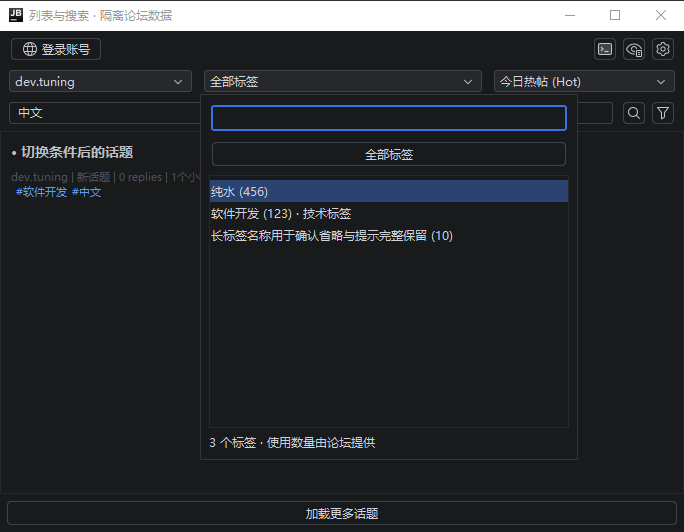
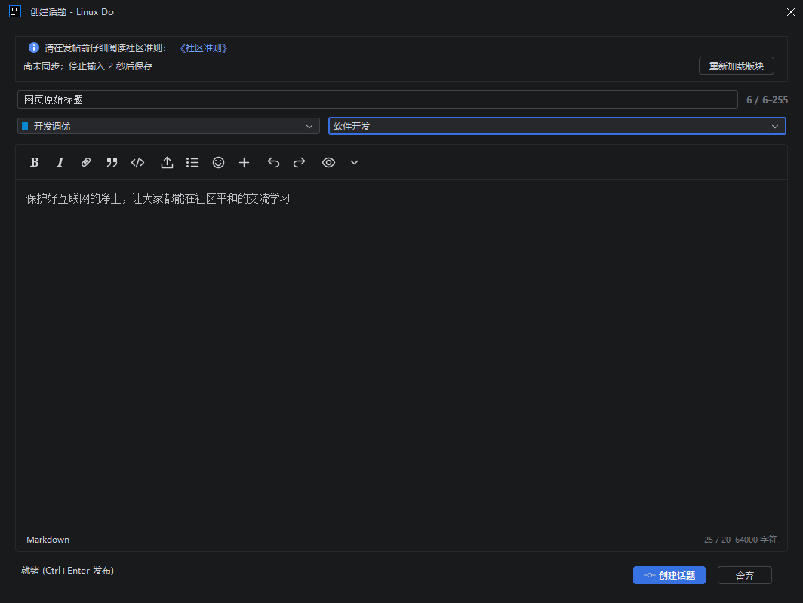
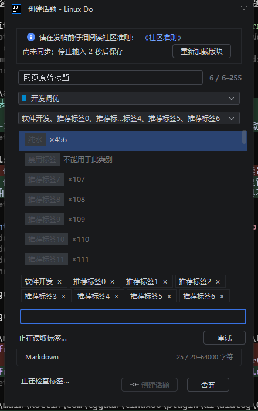

# 列表标签、高级搜索与弹窗验证

2026-10-03。版本 1.0.1，交付源码及本地安装包，没有自动发布或关机。

## 实现范围

| 界面 | 行为 |
| --- | --- |
| 话题列表 | 标签原生下拉框紧邻板块，整块可展开，菜单搜索名称及可见分组，显示服务器使用数量；“全部标签”清除筛选。板块、标签与最新、热门、新话题、未读组合在服务器执行，切换回到第一页。刷新保留已加载页，分页及返回保留筛选，关键词搜索继承条件，手写条件优先。 |
| 高级搜索 | 按关键词与范围、板块与标签、作者、状态与时间、数量与排序分组；常用展开、更多折叠，表单可滚动。板块搜索层级名称及描述，标签多选并支持 AND/OR，作者联想。独立解析模型保留引号短语、否定条件及未知语法，回填并替换已有条件，校验日期与数量范围，重置及复制查询。 |
| 创建话题 | 板块与标签原生下拉框等高，整块展开；菜单内展示可移除标签块，主框显示选择摘要及完整悬浮提示。菜单内多标签换行、长名称省略；窄窗口上下排列。检查、必选组及错误提示左对齐放在标签框下，正常成功隐藏，错误可重试。保留选中项重新校验新板块约束，数量、禁用项及未满足的必选组阻止发布。 |
| 主题变化 | 创建与回复窗口更新整个原生控件树、编辑器背景、光标、选区颜色及预览 CSS；高级搜索同步更新原生控件。颜色刷新保留正文、标题、已选标签、光标选区和草稿状态，已加载预览保留文档及滚动。 |
| 会话与错误 | 请求及列表条件带会话版本，丢弃旧请求，标签与功能开关缓存按账号会话隔离。列表及菜单支持空结果、失败重试；普通 429 提示冷却，Cloudflare 429 提示验证。 |

## 网页版对照

通过专用已登录 Chrome 读取 `https://linux.do/search?expanded=true` 的实际组件与服务；该页面对照过程没有论坛写入。原始记录为 `build/search-reference/linuxdo.json`、`requests.json` 与 `linuxdo-advanced-search.png`，选项及请求记录另存为 [网页选项](reference/advanced-search-linuxdo.json)与[只读请求](reference/advanced-search-requests.json)。随后根据用户的真实数据联调授权，另行完成下述当前包草稿接续测试。

核对了 Discourse [高级筛选组件](https://github.com/discourse/discourse/blob/main/frontend/discourse/app/components/search-advanced-options.gjs)、[搜索排序控制器](https://github.com/discourse/discourse/blob/main/frontend/discourse/app/controllers/full-page-search.js)、[标签目录与权限](https://github.com/discourse/discourse/blob/main/app/controllers/tags_controller.rb)、[标签搜索](https://github.com/discourse/discourse/blob/main/app/services/tags/search.rb)及[标签组约束](https://github.com/discourse/discourse/blob/main/lib/discourse_tagging.rb)。使用服务器返回的可见标签目录，不以可发帖标签权限限制浏览候选；必选组依据已解析的选中标签 ID 重新检查。

| 条件 | Linux Do 实际页面与插件支持 |
| --- | --- |
| 公共范围 | 标题、首楼、置顶、Wiki、含图片；图片使用 `with:images`。 |
| 登录范围 | 创建、参与、点赞、书签、已读、未读、关注、跟踪；`in:all` 包含个人消息，`in:messages` 仅个人消息。游客隐藏这些入口。个人消息仅搜索和阅读，服务器决定访问权限。 |
| 状态 | 开放、关闭、公开、归档、无回复、单人参与；实际站点还启用已解决、未解决。 |
| 数量 | 帖子数包含首楼，使用 `min_posts/max_posts`；浏览量使用 `min_views/max_views`。 |
| 日期 | `after/before`，输入有效 YYYY-MM-DD；兼容已有查询中的距今天数。 |
| 排序 | 相关度不追加 order；最新回复 `latest`、最多点赞 `likes`、最多浏览 `views`、最新话题 `latest_topic`、登录后的最近阅读 `read`。站点启用票数排序 `votes`。 |
| 站点扩展 | 检测解决状态、话题投票和板块专家开关；站点启用专家问题、专家回应及尚无专家帖子三项筛选。无法读取扩展开关时提供重试，未确认的扩展入口隐藏，已有手写条件保留。 |

只读 GET 校验：`/tags.json` 返回 HTTP 200、1,820 个普通候选及分组；`/tags/c/4/纯水/l/top.json?page=0&period=daily` 返回 30 个话题；同一组合的未读列表返回空结果。三项请求均为 HTTP 200，`writes=0`。

补充实际搜索接口读取：板块与标签、帖子数与浏览量条件组合，标签 AND/OR，日期与最新话题、最新回复、浏览量、点赞排序均返回 HTTP 200。当前账号 `in:messages order:latest` 返回 4 条命中；读取其中一条消息返回 HTTP 200、`archetype=private_message` 和 1 个可读帖子。用户名联想返回 19 个候选。共 7 项只读请求成功，没有写入；报告只保存状态、数量和固定查询，不保存私信标题、正文、账号凭据或私信 ID，见[真实搜索记录](reference/live-search-api.json)。这些结果证明当前账号具有实际搜索及读取权限；游客入口、权限失败处理和命中楼层导航另由隔离 IDE 回归验证。

## 验证证据

| 检查 | 结果 |
| --- | --- |
| 全量桌面单元测试 | 321 项通过，0 失败、0 错误、0 跳过 |
| 打包及结构检查 | `buildPlugin`、`verifyPlugin` 通过 |
| 实际 IntelliJ IDEA 2026.2.3 | 162 项通过，`IDE_UI_PASS=true`；EDT 心跳 P95 为 29.8322ms |
| 鼠标及键盘 | 实际鼠标点击标签框左侧打开菜单；板块键盘及鼠标选择、标签分组搜索及 Enter 选择通过 |
| 选择器与提示 | 高度一致，外部无删除控件，菜单内移除；200 个附加候选连续重开 15 次，440px 窗口中八标签换行；必选组与读取失败阻止发布，重试成功隐藏提示 |
| 主题与缩放 | 深浅主题、1.25 倍动态缩放、窗口变窄通过；整个弹窗、编辑区、打开的预览同步更新，正文、选区、标题及标签保留 |
| Plugin Verifier 1.410 | 目标 IU-262.10968.63：Compatible |
| 干净目录构建 | `build/release-check/da43fcd6-41d3-4d8f-be0d-2e54d3efe5f9/` 全新编译、测试、打包通过；ZIP SHA-256 与工作区包逐字一致 |

实际 IDE 记录：[断言报告](reference/ide-ui-tag-search.txt)，原始目录 `build/host-smoke/e435ce52-8856-44c3-819f-e9958020a606/`。汇总及 ZIP SHA-256 见[验证摘要](reference/tag-search-verification-summary.json)。兼容性报告位于 `build/reports/pluginVerifier/IU-262.10968.63/`。

当前包的真实草稿接续也已通过：IDE 自动保存 → 网页原生编辑器恢复并保存 → IDE 再次恢复正文和第 3 楼目标 → 清理自有测试草稿；最后读取为 `draft=null`。报告为[草稿结果](reference/live-draft-handoff.json)与[实际 IDE 断言](reference/live-draft-ide.txt)，原始目录 `build/draft-handoff/59ce34bd-13fd-45cc-887b-c716531bdfce/` 和 `build/host-smoke/fa81d466-1d3a-4ccf-8a9b-f074d3dfc1aa/`，恢复窗口截图已检查。测试使用生产 IDE 编辑器和草稿会话，通过专用浏览器认证桥接访问真实草稿接口；这是浏览器认证传输的联调证据。没有发送帖子、回复或 Boost，测试草稿已清理；现有用户草稿受内容及序列核对保护。

两个实际 IDE 验收目录中的全部 13 个插件 JAR 均与交付 ZIP 逐字相同；工作区源码及构建配置与干净构建快照一致，见[产物核对](reference/current-artifact-audit.json)。因此本次真实接续对应 1.0.1 当前安装包。

安装包：`build/distributions/linuxdo-jetbrains-plugin-1.0.1.zip`，相邻 `.sha256` 文件提供校验值。源码修改保留在当前工作区，另交付 `build/delivery/linuxdo-jetbrains-plugin-1.0.1-source.zip`。

SHA-256：`87b3034453ba9ebccea736ec7a115af2f234047308336da3d2d932b801b16c3e`。

干净构建默认采用 headless 测试，两项系统剪贴板测试按既有规则跳过；桌面全量测试已单独验证全部 321 项。首次干净编译遇到 Kotlin 编译器 `GC overhead limit exceeded`，已将编译器堆内存配置为 2GB；随后全新源码目录构建成功，产物与已通过实际 IDE 及 Verifier 的安装包完全相同。

单元测试覆盖列表组合、标签 UTF-8 路径编码、分页、账号缓存失效、旧回调丢弃、查询解析回填、AND/OR、排序、日期及数量。实际 IDEA 回归使用打包插件、真实窗口及 JCEF，论坛传输和草稿由内存模拟，`REAL_FORUM_WRITES=0`；包含草稿恢复、自动同步、冲突、账号切换、上传与发布校验。

## 完整计划核对

| 目标 | 当前验收依据 |
| --- | --- |
| 列表单标签、全部标签、板块旁可搜索下拉框、窄窗换行及标签点击筛选 | 实际 IDE：`IDE_TAG_KEYBOARD_GROUP_SEARCH_SINGLE_SELECTION`、`IDE_TAG_NEXT_TO_CATEGORY_AT_NARROW_WIDTH`、`IDE_LIST_TAG_CLICK_FILTERS_ON_SERVER`；列表及菜单截图 |
| 候选名称、数量、可用分组、失败重试，不受发帖标签权限限制 | `TopicListFilterTest`；实际 `/tags.json`；IDE 菜单分组搜索及失败重试 |
| 板块、列表类型、标签与分页组合，刷新和返回保留条件 | `TopicListFilterTest` 所有列表类型及 UTF-8 编码；IDE 热门组合、分页刷新与清除搜索恢复 |
| 关键词继承条件，已有手写条件优先，不重复追加 | `AdvancedSearchQueryTest`；IDE `IDE_SEARCH_INHERITS_TAG_CATEGORY`、`IDE_SEARCH_EXPLICIT_OVERRIDES_NO_DUPLICATES` |
| 标签、板块、列表类型及账号隔离，旧请求丢弃 | 会话缓存单元测试；IDE 查询切换、账号切换及销毁后的旧回调断言 |
| 高级搜索分组、折叠、滚动，板块层级、标签多选 AND/OR、作者联想 | 深浅主题与窄窗截图；IDE 滚动、标签 OR；解析单元测试；实际 AND/OR 搜索及用户名联想接口 |
| 公共及个人范围、图片、状态、站点扩展和所有内容/个人消息 | Linux Do 原生组件及开关对照；能力模型单元测试；IDE 游客隐藏、登录个人消息和最近阅读；真实个人消息搜索与读取 |
| 日期、帖子数及浏览量上下限，正确排序、错误定位 | 查询模型日期、数字及范围测试；IDE 日期定位；网页排序映射和真实查询 HTTP 200 |
| 回填与替换，保留引用、否定及未知语法，重置和可复制预览 | `AdvancedSearchQueryTest`；高级搜索表单与系统剪贴板桌面测试；IDE 回填替换 |
| 搜索继续分页，摘要及命中楼层定位 | IDE 摘要、失败保留页、同页重试去重及命中楼层导航 |
| 共享标签组件，发帖数量、禁用项、必选组规则 | 浏览单选、搜索和发帖多选使用 `TagSelectionField`；IDE 禁用项拒绝、必选组阻止发布、失败重试 |
| 创建话题等高选择器，整块触发，移除仅在菜单内，长名称和多标签换行 | IDE 真实鼠标点击左侧、等高、菜单内移除、长名称提示；八标签窄窗截图 |
| 提示位于标签下方，检查/要求/错误及重试，成功隐藏，板块切换重新验证 | `TagHint` 状态模型和板块约束校验；IDE 必选组、错误和成功三种提示断言与截图 |
| 实时主题、缩放与键盘行为，保留文档风格及 IDE 配色 | IDE 全原生面板、编辑器光标和选区、预览主题更新，内容及标签保留；1.25 倍缩放、键盘选择与深浅截图 |
| 草稿恢复、自动同步及发布校验不回退 | 当前包真实 IDE↔网页接续及清理；隔离 IDE 草稿恢复、冲突、账号切换与发布校验 |
| 登录/游客、空结果、失败、普通 429 和 Cloudflare 提示 | 单元测试与隔离 IDE 断言；真实未读组合空列表；异常写入场景使用隔离传输 |
| 全量测试、干净构建、目标 IDE Verifier、源码/安装包/三处截图 | 321 项桌面测试、162 项实际 IDE 检查、Compatible；干净产物与安装包相同；本文交付链接及截图 |

计划及后续四项反馈均已实现并通过对应检查；未执行发布或关机。

## 实际 IDE 截图

以下使用示例数据，没有展示真实个人消息、凭据或私有草稿。

