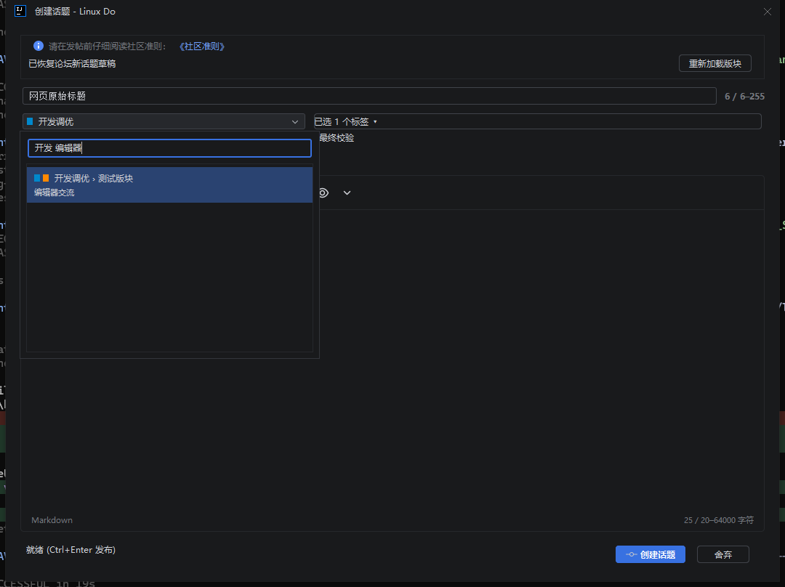
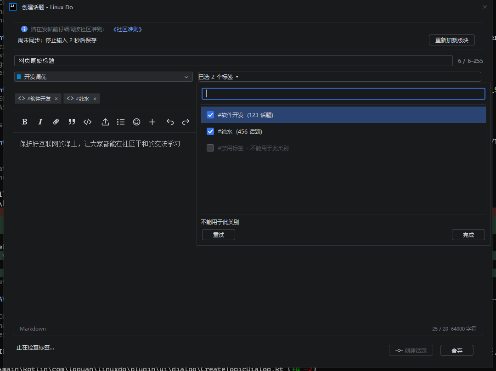

# 新建入口与板块、标签选择验证

2026-10-01。版本仍为 1.0.0，未发布或上传。本轮使用实际 IDEA 桌面及内存模拟论坛传输；没有真实保存、删除新话题草稿，也没有发送帖子或回复。

本文记录入口、尺寸和选择器优化阶段的安装包。后续 `Limit 无效` 修复后的当前安装包、290 项单元测试和 99 项实际 IDEA 回归见 [标签修复验证](tag-search-verification.md)。

后续标签冻结、网页式标签弹层及板块选中后收起的最新安装包、105 项实际 IDEA 回归见 [选择器修复验证](picker-freeze-verification.md)；下文复选列表描述及截图属于本阶段历史实现。

## 改动

- 新建入口直接打开编辑器：没有草稿时显示空表单，有草稿时自动恢复标题、正文、板块和标签。使用论坛原生单份 `new_topic` 键，同一论坛账号只保留一个活动的新话题编辑器；再次打开会聚焦当前窗口并保留未保存输入。冲突处理和未知字段保护沿用现有草稿服务。键名依据 [Discourse 编辑器模型](https://github.com/discourse/discourse/blob/main/frontend/discourse/app/models/composer.js)。
- 新建窗口的编辑区域默认 1040 × 700，回复窗口默认 1000 × 640，随 IDE 缩放调整；仍支持缩小窗口和按需预览。
- 板块选择提供搜索面板，按名称、父板块、slug 和描述匹配；显示父子路径、颜色及描述，只列出明确允许发帖的板块。支持方向键、Enter 选择和 Escape 关闭。
- 标签选择提供搜索及复选列表，可以连续勾选、取消并保留面板；已选标签显示为可移除标签块。展示话题数量、不可用原因和数量限制，保留空结果与错误状态，可直接重试。按当前板块校验已选标签，合并短时间内的连续校验，丢弃过期查询和账号切换后的回调。
- 标签请求遇到 Cloudflare 429 时提示侧边栏人机验证；普通 429 提示论坛频率限制和冷却。重试成功清除错误提示。

## 验证结果

| 检查 | 结果 |
| --- | --- |
| 单元测试 `test -PdesktopTests=true` | 287 项通过，0 失败、0 错误、0 跳过 |
| `buildPlugin`、`verifyPlugin` | 通过 |
| 实际 IDEA 桌面回归 | 97 项通过，`IDE_UI_PASS=true`；`REAL_FORUM_WRITES=0` |
| Plugin Verifier 1.410 / IDEA 2026.2.3（IU-262.10968.63） | Compatible |
| 单份草稿入口 | 无草稿直接新建、有草稿自动恢复、重复打开保留当前编辑器、关闭后恢复同一键通过 |
| 板块与标签交互 | 父板块和描述搜索、slug 选择、空结果、多选保持打开、取消选择、禁用原因、失败保留选项、重试、两类 429 提示通过 |
| 既有功能回归 | 两秒同步、断网、409、失效标签、账号切换、发布结果不明保护、模拟审核及清理保护、按需预览、440px 窄窗口通过 |

实际 IDE 报告：`build/host-smoke/761c3ae8-bfb1-4a11-abc8-56dab6f57d78/result.txt`。EDT 心跳 P95 为 32.7809ms。

兼容性报告：`build/reports/pluginVerifier/IU-262.10968.63/plugins/com.lgguan.linuxdo.plugin/1.0.0/verification-verdict.txt`。

安装包：`build/distributions/linuxdo-jetbrains-plugin-1.0.0.zip`。SHA-256：`b32254c9609520866276b1b798cb1cd6c0bad1588e7c15ce0d34ea3305649d08`。

## 同一安装包的真实回复草稿接续

用户确认完成 Cloudflare 验证后，使用话题 482293、指定正文和第 3 楼回复目标，完整验证 IDE 保存 → 网页原生编辑器恢复并保存 → IDE 再恢复 → 清理。真实论坛保存与删除返回 HTTP 200，删除后读取确认 `draft=null`；`DRAFT_HANDOFF_PASS=true`、`IDE_UI_PASS=true`、`postSubmitted=false`，进程正常退出。

报告：`build/draft-handoff/9b7a3046-9407-4464-b8b4-809c4335a852/result.json`；真实 IDEA 窗口报告：`build/host-smoke/c6e1fae2-2e34-49db-a115-2f1a4d5ae78d/result.txt`。真实接续使用浏览器登录会话的草稿桥接；论坛凭据不导出。真实新话题草稿没有写入，发布路径仍使用隔离模拟。

