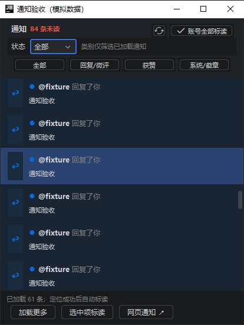
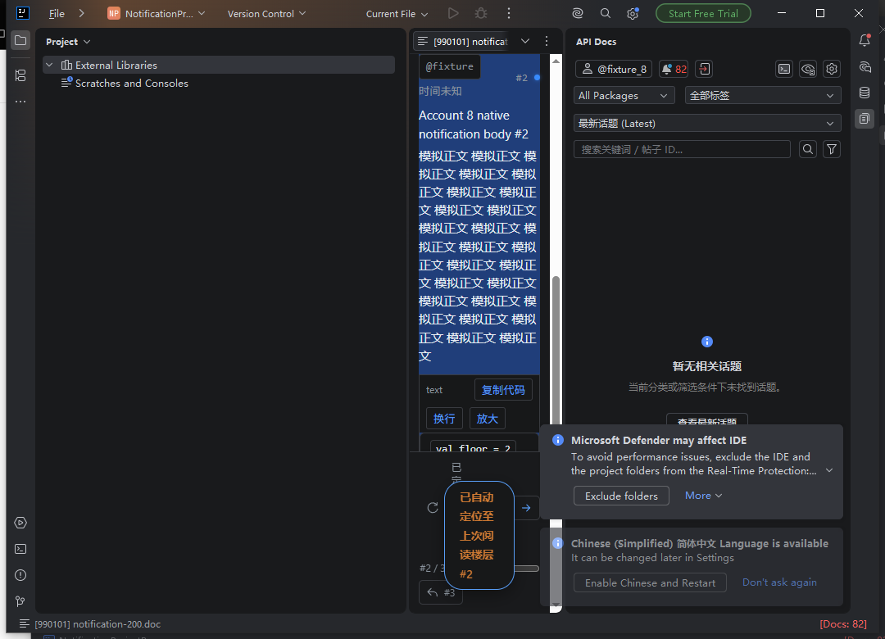

# 通知闭环验收

2026-10-03，首期通知优化。源码和验证安装包沿用当前构建版本 1.0.2；这是尚未发布的工作区变更，没有自动发布。个人内容入口、消息收件箱及编辑辅助留待后续批次。

## 使用与实现

通知入口保留紧凑弹窗和 IDE 配色。状态下拉框向服务器请求全部、未读或已读通知，每页默认 30 条；底部“加载更多”按用户操作读取历史并按 ID 去重。类别标签只筛选已加载通知，没有匹配且仍有分页时说明可以继续加载。

刷新和自动轮询更新第一页与账号计数，保留已加载历史、仍存在的选中项和滚动锚点；大量新通知在首页与历史之间形成空隙时，后续手动加载从首页续页补齐。失败不清空内容，重试使用失败的页参数。分页续链必须属于当前论坛同源 `/notifications` 或 `/notifications.json`，验证 offset、limit、状态及参数集合，再重新构造当前账号请求；不转发续链 username 或任意 URL。应用级服务合并相同请求，读取和标读串行，沿用原有轮询频率和请求冷却，不扫描全部历史。

角标独立读取 `/notifications/totals.json`，合计普通通知与个人消息，不重复叠加审核队列、群组收件箱或话题跟踪数。失败保留最后有效值并显示“未更新”，没有有效值显示“未读数量暂不可用”。账号变更或确认登录失效清空账号数据；同账号重复验证保留有效计数和冷却状态。

话题打开和楼层导航增加可选完成回调，结果为成功、失败或取消。生产阅读器由可信页面回传请求 ID、页面标识与显示结果；同时检查账号版本、实际浏览器组件可见性、运行时状态及老板键。正文成功显示且目标楼层定位成功后才提交单条标读；没有楼层时确认可见正文。关闭、切换编辑器标签页、被新导航取代、目标缺失、浏览器故障、超时和旧账号回调不会标读。切回取消过的标签页不会恢复旧确认，重新点击通知创建新请求。标读响应必须明确确认成功，随后更新所有窗口并重新读取计数；失败保留未读并提供重试。

网页目标无法确认显示，保持未读；弹窗提供“选中项标读”，气泡提供手动标读／重试。“账号全部标读”作用于整个账号，包含未加载通知。未知类型提供通用文案与安全的网页通知、话题或徽章入口，不自动标读。通知类型由本站配置集中解析，未核实时不把编号 34 当作 Boost。

接口设计依据官方 [通知控制器](https://github.com/discourse/discourse/blob/main/app/controllers/notifications_controller.rb) 与 [计数序列化器](https://github.com/discourse/discourse/blob/main/app/serializers/user_notification_total_serializer.rb)。本站支持情况以以下只读证据为准。

## 本站只读核验

最终核验通过已有专用 Chrome 的登录页面执行 6 个 GET（此前探测 3 个，本轮合计 9 个），不新建论坛页面，不读取或导出 Cookie、CSRF、正文、用户名或通知 ID，不调用 recent、mark-read 或计时接口。证据只保存类型配置、字段存在性和汇总：[本站只读记录](reference/linuxdo-notifications-readonly.json)。

| 检查 | 本站结果 |
| --- | --- |
| `/site.json` | HTTP 200；`assigned=34`，**`boost=43`**。纠正旧代码的 Boost 编号假定。 |
| 全部第一页 | HTTP 200，16 条；返回 `total_rows_notifications`、`seen_notification_id` 和 `load_more_notifications`。 |
| 未读筛选 | HTTP 200，0 条，total 为 0。当前账号没有未读通知。 |
| 已读筛选 | HTTP 200，16 条，所有行均为已读。 |
| offset=30 | HTTP 200，空页，total 仍为 16。 |
| 账号计数 | HTTP 200，普通通知和个人消息字段均存在，本次均为 0。 |

本站样本中可识别回复、徽章、个人消息和回应通知的类型及目标字段。Boost 仅核实本站类型配置，本次账号样本没有 Boost 通知。超过一页、超过 30 条未读及正数个人消息的行为使用模拟数据验证。真实单条／全部标读及真实 403、429、Cloudflare、浏览器故障没有主动触发；本次真实写请求为 **0**。

## 回归结果

完整结果及安装包校验值见 [验证摘要](reference/notification-workflow-summary.json)。

| 检查 | 结果及范围 |
| --- | --- |
| 单元与模拟传输 | 360 项，0 失败、0 错误、0 跳过，其中新增通知流程 21 项。含分页、重复、空页、重试、历史保留、新通知空隙、删除与状态清空、计数去重及降级、单条／全部标读、登录失效、账号变化、合并请求、429／Cloudflare、类型映射与显示回调。 |
| 实际 IDEA / JCEF | Windows x64，IntelliJ IDEA Ultimate 2026.2.3 / IU-262.10968.63，生产插件 ZIP，77 项通过。原生通知分页、选中项与滚动锚点、类别空状态、状态切换、计数失败、手动标读、标读失败重试、生产文件编辑器新开与复用的显示确认、无楼层正文、缺失楼层、HTTP 404和账号全部标读；另覆盖原有正文、Boost、计时、缩放及浏览器恢复。见 [IDE 原始记录](reference/notification-ide-ui.txt)。 |
| 两个实际 IDEA 项目窗口 | 同一目标 IDE 和生产 ZIP，38 项通过。从实际通知按钮和列表鼠标点击进入 `FileEditorManager`；新开与复用、跨窗口计数同步与请求合并、403/404/缺失楼层、本站 Boost 43、徽章、未知类型和个人消息、切换标签页取消、老板键隐藏与恢复、模拟账号切换及原生 JCEF 通道断连后重试。IDE 气泡通过 `Notification.fire` 派发已注册的生产动作。见 [项目窗口原始记录](reference/notification-project-ide-ui.txt)。 |
| 浏览器 | 新增 11 项确认回归与原有 16 项导航回归通过。在独立上下文运行生产脚本，含新楼层、复用、无楼层正文、缺失目标、不可见正文、失败／冷却、取消和旧请求。见 [浏览器记录](reference/notification-browser.json)。 |
| 打包 | `test buildPlugin verifyPlugin -PdesktopTests=true --offline` 通过。 |
| 目标 IDE Plugin Verifier | Verifier 1.410，目标 IU-262.10968.63，Compatible。见 [原始记录](reference/notification-plugin-verifier.txt)。 |





IDE 中所有通知读取、单条／全部标读、正文请求与计时均由内存 HTTP 传输接管，使用示例凭据和数据，没有连接真实账号执行写操作。两个项目窗口测试使用实际 IDE 项目、工具窗口、文件编辑器管理器、老板键服务及原生 JCEF；账号切换由认证服务切换模拟身份，未提交真实登录表单。macOS 与 Linux 的原生 IDE 验收尚未执行，属于持续优化路线。

## 首期要求核对

| 要求 | 验收证据 |
| --- | --- |
| 三种状态、30 条分页、手动加载、去重与空页 | 单元；77 项原生回归中的分页与状态筛选；本站状态与空页 GET。 |
| 刷新／轮询保留历史、选中项和滚动锚点 | 单元历史合并；77 项原生回归的刷新与锚点断言；轮询复用同一首页合并路径。 |
| 类别仅筛选已加载内容，空状态提示继续加载 | 77 项原生回归的类别空状态断言。 |
| 分页对象元数据、同源续链、过期账号拒绝 | 单元分页验证；本站只读字段记录。 |
| 账号计数超过单页、普通与私信不重复、失败降级 | 单元计数解析；77 项原生计数降级；两个项目窗口显示 83，包含模拟私信计数 8。 |
| 手动与轮询请求合并、429／Cloudflare 冷却 | 单元模拟传输；两个真实项目窗口同时刷新仅一次 HTTP 读取。 |
| 新开与复用，正文及目标楼层显示后标读 | 77 项原生回归；两个真实项目窗口通过生产入口打开并验证目标正文。 |
| 无楼层正文、403、404、缺失楼层不误标 | 无楼层见 77 项原生回归；403/404/缺失楼层见项目窗口测试。 |
| 取消、老板键、账号变化、浏览器失败不误标 | 单元及浏览器；项目窗口测试的标签页取消、老板键恢复、过期气泡、账号切换及原生通道断连。 |
| 网页目标保持未读、手动标读与失败重试 | 类型路由单元；77 项原生手动标读和失败重试；项目窗口未知类型手动标读。 |
| 账号全部标读包含未加载通知、成功同步所有窗口 | 单元及 77 项原生全部标读；两个真实窗口的成功标读与计数同步。 |
| Boost／徽章／私信／未知类型的文案与路由 | 本站配置 `boost=43`、`assigned=34`；单元；项目窗口实际列表文案及 Boost／私信打开。 |
| 回归、打包、目标 IDE Verifier、使用说明 | 360 项测试、两组原生验收、两组浏览器回归、构建与 Compatible 记录；本文及 README。 |

## 复现

先设置 JDK 21 的 `JAVA_HOME`；目标 IDE 需为受支持的 262 系列，浏览器脚本需安装 Playwright 并有专用 Chrome CDP。Windows 示例：

```powershell
.\gradlew.bat test buildPlugin verifyPlugin -PdesktopTests=true --offline --console=plain
.\gradlew.bat runPluginVerifier '-PverifierIdePath=C:\path\to\IDE' -PverifierOffline=true --offline --console=plain
python tools/smoke.py ui --reader-only --ide-home 'C:\path\to\IDE' --plugin-zip build/distributions/linuxdo-jetbrains-plugin-1.0.2.zip
python tools/smoke.py ui --notifications-only --ide-home 'C:\path\to\IDE' --plugin-zip build/distributions/linuxdo-jetbrains-plugin-1.0.2.zip
python tools/navigation-fixture.py
python tools/notification-navigation-regression.py
python tools/navigation-regression.py
python tools/notification-reference-check.py
```

最后一个命令只在已有专用浏览器页面中读取本站字段；遇论坛错误停止，不自动重试或标读。验证安装包位于 `build/distributions/linuxdo-jetbrains-plugin-1.0.2.zip`；该包包含未发布优化，其校验值见验证摘要，不能等同于先前发布记录中的安装包。
