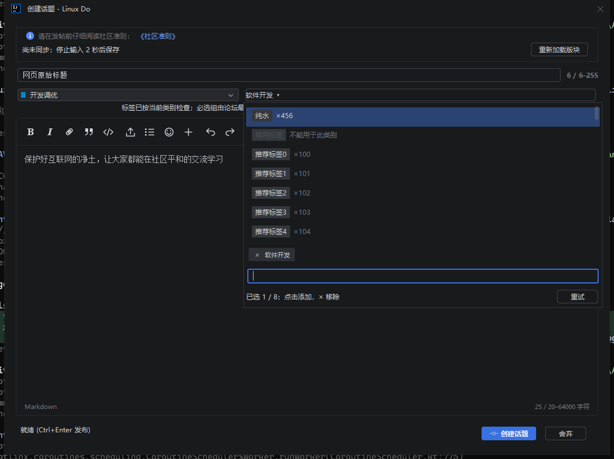
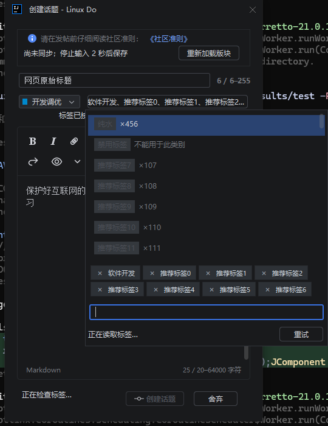

# 标签冻结与网页式选择器验证

2026-10-01。修复选中标签后再次打开导致 IDE 冻结，按用户截图 `build/tmp/tag.jpg` 调整标签弹层，并在选择板块后立即收起弹层。版本仍为 1.0.0，未发布或上传。

## 原因与改动

IDE 冻结报告记录了 35 秒的 EDT 停顿，调用链经过 `CreateTopicDialog.showTagSuggestions`、`DefaultListModel.addElement`、`WideSelectionListUI.getItemPreferredSize` 和 AWT 组件层级更新。旧渲染器每次绘制或测量都新建复选控件；列表逐项追加又反复触发布局。

- 标签及板块候选行复用固定的渲染控件；标签行使用固定高度，候选列表批量更新，避免渲染容器累积组件。
- 标签弹层从上到下显示候选标签及话题数量、已选标签块、搜索框。点击候选项连续添加，已选项从候选列表移除；标签块使用紧凑的 × 按钮删除，多个标签自动换行。主按钮显示已选名称并在空间不足时截断，悬浮提示保留完整名称。
- 弹层关闭会取消延迟搜索并使旧回调失效；重新打开保留选择，不重复校验已确认的标签。保留板块约束、数量限制、禁用原因、失败重试，以及普通 429 和 Cloudflare 验证提示。
- 板块鼠标或 Enter 选择先关闭弹层，再应用选项；搜索空结果继续保留面板。

## 最终安装包验证

| 检查 | 结果 |
| --- | --- |
| 全量单元测试 `test -PdesktopTests=true` | 290 项通过，0 失败、0 错误、0 跳过 |
| `buildPlugin`、`verifyPlugin` | 通过 |
| 实际 IDEA 2026.2.3 桌面回归 | 105 项通过；`IDE_UI_PASS=true` |
| 标签重复打开 | 保留已选项，加载 200 个附加候选标签并连续关闭、重开 15 次；行渲染器复用，渲染容器组件数量保持有界 |
| 网页式布局 | 候选列表、已选块、底部搜索框的位置断言通过；添加与 × 移除、空结果和失败重试通过 |
| 窄窗口 | 440px 编辑窗口中选中 8 个标签，400px 弹层内分两行显示；控件边界未溢出，删除按钮宽度 16px，所有附加标签可移除 |
| 板块点击 | 使用 Robot 实际鼠标点击搜索结果，选中正确板块 ID 并关闭弹层 |
| Plugin Verifier 1.410 / IDEA IU-262.10968.63 | Compatible |

实际 IDEA 报告：`build/host-smoke/71ad166a-816e-475c-a497-f608f6090d18/result.txt`。本轮使用隔离模拟论坛，`REAL_FORUM_WRITES=0`，没有真实保存或删除草稿，也没有发送帖子、回复。已检查正常弹层、窄窗口八标签及板块搜索截图。

兼容性报告：`build/reports/pluginVerifier/IU-262.10968.63/plugins/com.lgguan.linuxdo.plugin/1.0.0/verification-verdict.txt`。

安装包：`build/distributions/linuxdo-jetbrains-plugin-1.0.0.zip`。

SHA-256：`18184db7d049d722ff8c4dc5a17b5b9a0962ba908bd598aa7da59801538bc997`。

此前的真实标签接口和回复草稿接续记录见 [标签接口验证](tag-search-verification.md) 与 [草稿接续记录](composer-selection-verification.md)。本轮修改选择器 UI；没有把旧包的真实草稿测试报告当作当前包重新联调的结果。

