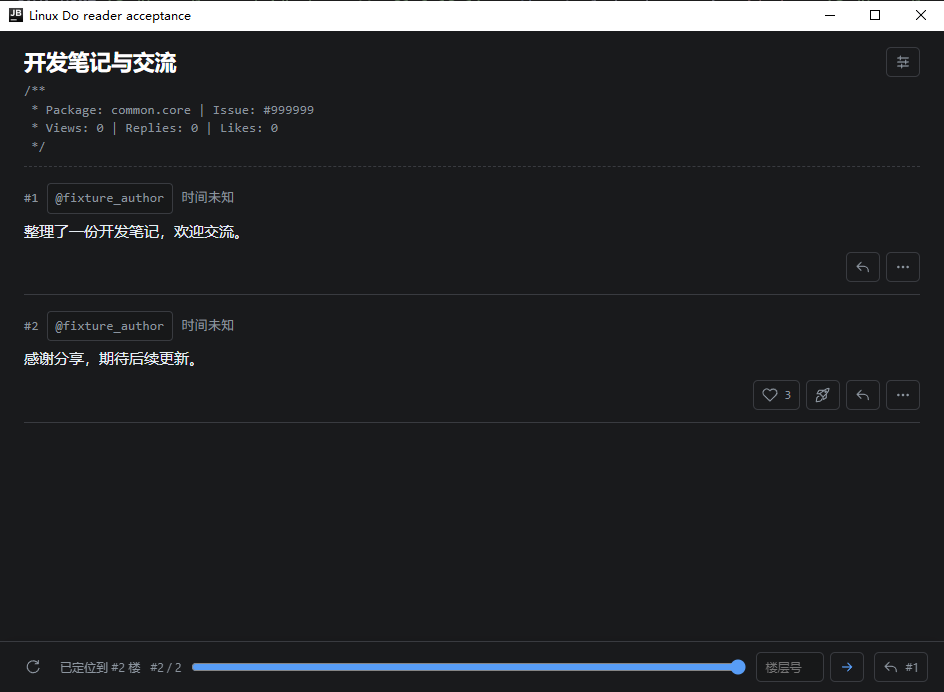
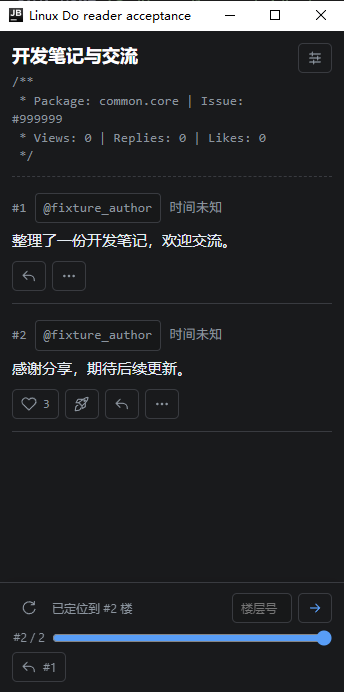
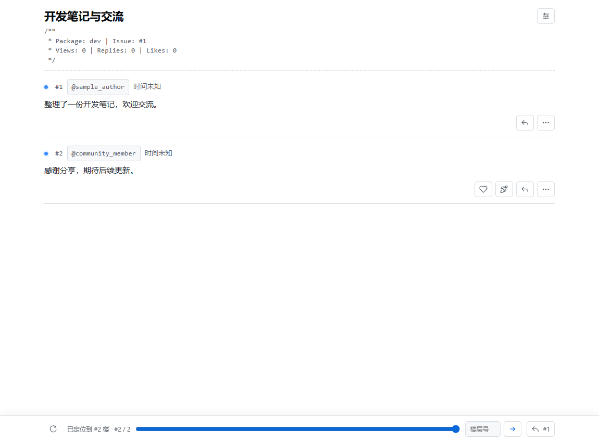
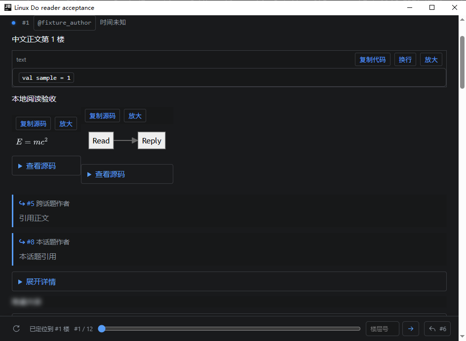
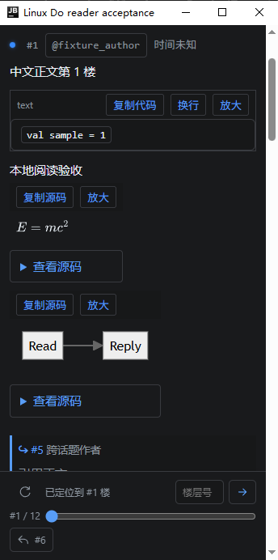
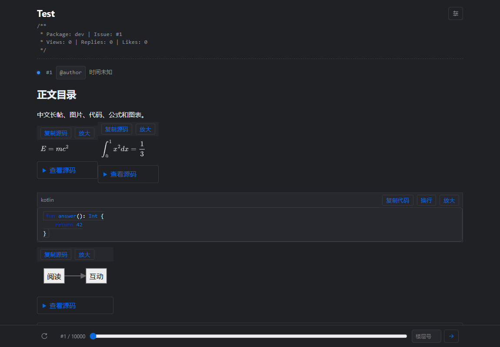
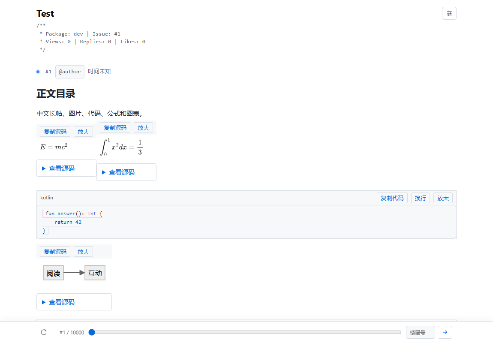
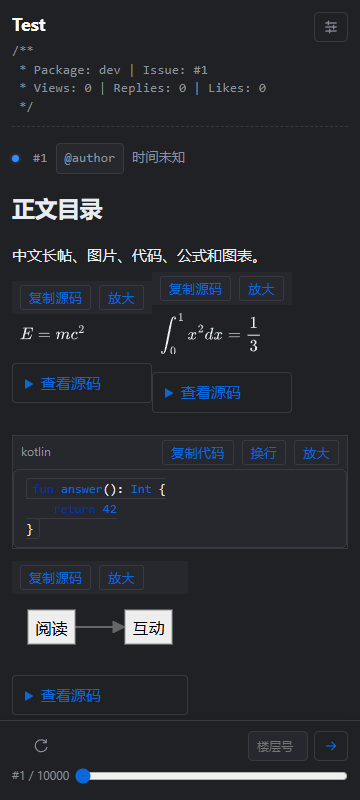

# 帖子正文、阅读与交互验收

2026-10-02，源码与安装包版本保持 1.0.0，未推送 GitHub、未发布 Marketplace。本次真实论坛调研只读，未发送、编辑、删除、举报、投票、收藏或订阅真实帖子；全部写操作使用模拟传输验证。已有草稿授权未扩大。

| 阶段与功能 | 支持范围与行为 |
| --- | --- |
| 渲染：正文与预览 | 共用安全清洗、结构转换和内容增强；首次、追加及局部更新均经过同一流程。标题锚点按帖子隔离，保留列表、引用、表格、链接卡片、附件、表情、折叠及可再次隐藏的内容。 |
| 渲染：代码 | 已知语言高亮，未知语言保留纯文本；语言标签、换行切换、放大及原始源码复制。复制保留缩进与换行。 |
| 渲染：公式与图表 | 行内及块级 TeX、Mermaid；SVG 原生显示、源码复制、放大、失败提示。超长源码返回提示，不能调用 IDE 网桥。 |
| 渲染：离线引擎 | MathJax 3.2.2、Mermaid 10.9.3、highlight.js 11.11.1 随包提供；构建校验脚本与许可证 SHA-256，运行时没有 CDN 依赖。 |
| 渲染：图片 | 保留尺寸与缩略图，懒加载并预留比例；同帖切换、缩放、拖动、方向键与 Esc、复制图片/原图文件/地址及保存菜单。 |
| 渲染：音视频 | 原生播放控件；Bilibili 与 YouTube 合法嵌入在明确点击后加载，附浏览器入口；其他 iframe 转成说明和安全链接。播放器是否可播放仍取决于网络、地区和宿主解码支持。 |
| 渲染：隔离 | CSP 限制插件脚本、媒体与指定播放器来源；论坛脚本、事件属性和任意 SVG 被清洗；生成图表严格模式并再次清理。播放器子框架无法访问 IDE 网桥。 |
| 阅读：工具栏 | 阅读工具使用图标并对齐正文标题区域右上角，随标题滚动，默认收起，按当前状态显示首楼、末楼、未读、作者与楼主筛选、热门回复及目录；目录要求已加载正文包含标题，全部楼层入口只在筛选时出现，通知和书签要求已登录。定位状态与楼层快捷调整同一行；无效返回目标隐藏，单楼话题隐藏滑块与跳转输入。楼层分享收进对应帖子的“更多”。筛选跳转和刷新继续携带服务器筛选条件。 |
| 阅读：搜索与上下文 | 区分已加载查找与服务器话题搜索；服务器搜索逐页读取摘要，定位目标附近。引用和回复对象就地显示上下文，回复列表分页提供定位及引用；作者展示公开资料卡，相关话题在插件打开。 |
| 阅读：长帖与状态 | 最多 200 个完整帖子节点；移出节点用高度占位恢复。浏览器和原生正文缓存分别受 400 帖、32 MiB 上限约束；浏览器正文大小按序列化 DOM 的 UTF-16 长度保守估算，非整个进程内存限制。跳转附近优先保留。 |
| 阅读：局部更新 | 按帖子 ID 更新；正文未变时复用节点、选区和展开状态，正文改变时恢复仍存在的选中文字及折叠状态。不存在于新正文的文字无法继续作为有效选区。新回复提示查看，不强制跳到最后。 |
| 阅读：显示设置 | 独立字号、行距与阅读宽度，默认保持原效果；正文标题与帖子使用同一阅读宽度。监听 IDE 外观与编辑器配色事件，在当前文档中更新样式并保留选区、展开状态和滚动锚点；深浅判断依据实际编辑器背景。窗口缩放与滚动重新定位已打开的菜单，超出视口的入口自动关闭菜单。输入框和带修饰键的 IDE 快捷键不被导航按键截获。 |
| 列表：认证刷新 | 账号或会话变化立即废弃旧请求；凭证待确认时不发起列表刷新。认证通知与弹窗成功回调合并，登录和游客验证完成后各刷新一次，同账号再次确认不刷新列表。退出账号由认证通知统一刷新。 |
| 阅读：自动已读同步 | 编辑器及异步初始化完成后将焦点交给正文浏览器；只有前台、选中页面且正文实际可见时累计阅读时间，底栏覆盖的内容不计入可见范围。自动采样后更新蓝点与连续已读位置，全部读完隐藏“未读”入口；后台停止计时，沿用周期上报及切换时提交。同步失败保留本地已读并记录警告。 |
| 互动：权限、点赞与回应 | 权限缺失不默认允许，不展示无效操作，也不按用户名推断权限。元信息精简为楼层编号、作者、时间与回复对象，移除 Original Specification、Revision 和装饰分隔符；收藏只保留书签图标与“收藏 / 已收藏”文字；正文下方使用统一 SVG 图标显示可用的点赞、Boost 和回复，提供提示与无障碍名称；分享及其他有效操作收进默认关闭的“更多”，菜单保留图标和文字。服务器返回可用回应列表、帖子回应元数据与相应权限时，尚无人回应的帖子也显示首次回应入口；权限不足时隐藏。回应者入口要求已有回应。读取可用回应及当前状态，支持切换、取消、分页回应者。所有阅读窗口共用串行写入及 800ms 间隔，失败只更新相关楼层。 |
| 互动：收藏与通知 | 收藏添加、修改、删除、名称、未来提醒时间；分页书签列表含空列表。关注、跟踪、常规、免打扰与服务器同步。分页读取失败保留当前页供重试。 |
| 管理：编辑与历史 | 复用现有工具栏和预览，编辑原因、原始正文冲突基线；409 展示本地/服务器全文并明确选择继续编辑的版本。编辑不使用普通草稿。历史显示服务器可见的前后正文，并按服务器返回的版本导航。 |
| 管理：删除与举报 | 仅软删除及恢复；确认楼层、作者和首楼影响。首楼删除后核对服务器话题状态。举报类型、必填说明及自定义类型来自论坛配置，提交前确认对象与原因；成功提示等待论坛处理。 |
| 投票与答案 | 单选、多选、数字及排序问卷，读取组权限、选择数、结果可见性和撤票配置；已启用话题的投票、余额、赞成/反对问答投票及撤票、采纳/取消采纳答案。普通话题不显示问答投票，问答评论不能投答案票；服务器继续校验撤票时间窗等约束。 |
| 操作生命周期 | 网桥携带页面、账号 epoch、请求 ID；关闭或换账号后不应用旧回调。普通 429 与 Cloudflare 验证分别提示。结果不明先读服务器核对，不自动重复写；未确认则阻止当前页面再次提交。 |

三阶段验收均包含单元测试与生产页面回归。MathJax 本地资源方式参照[官方部署文档](https://docs.mathjax.org/en/latest/web/hosting.html)，Mermaid 严格模式参照[官方配置说明](https://mermaid.js.org/config/schema-docs/config.html#securitylevel)。编辑与历史协议参照 [PostsController](https://github.com/discourse/discourse/blob/main/app/controllers/posts_controller.rb) 和 [PostRevisionSerializer](https://github.com/discourse/discourse/blob/main/app/serializers/post_revision_serializer.rb)；收藏、自定义举报和问卷分别参照 [BookmarksController](https://github.com/discourse/discourse/blob/main/app/controllers/bookmarks_controller.rb)、[PostActionsController](https://github.com/discourse/discourse/blob/main/app/controllers/post_actions_controller.rb)、[PollsController](https://github.com/discourse/discourse/blob/main/plugins/poll/app/controllers/discourse_poll/polls_controller.rb)。问答投票使用服务器的 `up` / `down` 字符串方向，依据 [PostVotingVote](https://github.com/discourse/discourse-post-voting/blob/main/app/models/post_voting_vote.rb)。

网页结构样本位于 `src/test/resources/reader/`，只保存标签拓扑和结构属性，正文、作者、上传地址及外部目标均替换；来源与 SHA-256 单独记录。一次只读 GET 返回普通 429 后未重复请求，改为读取已打开网页的现有 DOM。复杂公式、图表、嵌入、问卷和自定义举报另由可重复的本地合成数据覆盖。

| 验证 | 结果与证据 |
| --- | --- |
| 全量桌面单元测试、`buildPlugin`、`verifyPlugin` | 310 项通过，0 失败、0 跳过；包含仅渲染有效能力、操作位于正文下方及次要操作收纳检查。最终报告 `build/reports/tests/test/`，依赖校验纳入 `processResources`。 |
| 生产浏览器回归 | 42 项通过，0 未捕获 JS 错误；`tools/reader-regression.py` 全部 HTTP 使用本地替身，覆盖深浅主题、360px 窄窗、图片菜单与图库、原始代码复制、公式/图表 CSP、四类问卷、分页搜索、筛选末楼、局部更新及万楼索引。报告 `build/reader-regression/result.json`。 |
| 万楼数据窗口 | 10,000 个帖子 ID，连续访问超过 400 个正文；最终 200 个完整节点、400 个缓存帖子、841 个占位，正文 418,204 字节；淘汰楼层可恢复，滚动锚点、选区和详情状态保持。大正文另外用单元测试验证 32 MiB 边界。 |
| 帖子布局回归 | 72 项通过；`tools/reader-layout-regression.py` 使用普通两楼帖子，检查深浅主题与 360px 窄窗口：无不可用占位、统一图标与无障碍名称、Boost 外置/分享收纳、正文标题区域右上角的阅读工具、精简楼层标题、收藏无重复星号、动态缩放菜单、定位状态与快捷调整同一行、按钮尺寸与字体一致、次要操作默认收起、菜单在窗口内，以及登录、标题和已读回传后的有效入口更新。报告 `build/reader-layout/result.json`。 |
| 实际 IDEA | 135 项通过；隔离账号和配置运行 `tools/smoke.py ui`，目标 IU-262.10968.63；最终截图与结果 `build/host-smoke/c2826034-6dfd-4296-9d6c-840558240eec/`。包含普通两楼帖子、长正文菜单、图标操作、正文标题区域右上角阅读工具、简洁楼层信息与收藏图标、同排定位与楼层调整、窄窗口及首次回应权限回归。实测登录和游客验证各只刷新一次列表，同账号再次验证不刷新；深浅编辑器配色与外观事件即时更新正文并保留选区和展开状态，阅读宽度无需重开即生效，五组连续窗口缩放验证实际视口和菜单边界。自动已读验证无需点击正文即可采样、更新蓝点及未读入口，实际请求经过生产 CSRF 与计时表单流程，检查楼层时间及总时长；后台停止计时。阅读账号只在内存中，HTTP 使用本地替身或拒绝传输；真实论坛写入为 0。 |
| 干净源码构建 | `tools/clean-release-build.py` 将当前完整源码复制到新目录并离线构建，记录源文件清单与 SHA-256，核对新包与工作目录包一致。 |
| Plugin Verifier | 最终安装包对目标 IU-262.10968.63 返回 Compatible；报告 `build/reports/pluginVerifier/IU-262.10968.63/`。 |
| 补充离线回归 | 旧导航浏览器回归 16 项全部通过，报告 `output/playwright/navigation-result.json`。原生 JCEF 的输入、会话、过期网桥、刷新分页、导航和运行时释放与连续视口缩放 64 项全部通过，报告 `build/portable-smoke/a262da87-6968-4e16-88fb-f865cf254822/result.txt`，最终标记 `PORTABLE_NATIVE_PASS=true`。 |
| 前轮补充检查 | Python 草稿请求防护 7 项、合成代理配置检查与独立宿主类加载检查此前全部通过。本次布局调整未修改这些功能；当前交付包在实际 IDEA 中的加载与页面显示由上述 135 项回归验证。未启用联网测试。 |

最终安装包：`build/distributions/linuxdo-jetbrains-plugin-1.0.0.zip`。用户在 IDE 的 Plugins → Install Plugin from Disk 中安装并按提示重启。

SHA-256：`101405165937e5a51cedb571977bacb01ddc768dcd3a20ab1896057bef3e216b`。

发布包使用全量编译。工作目录使用 `'-Pkotlin.incremental=false' --offline`，与新目录首次编译的包逐项内容及 SHA-256 一致；增量编译产生的内联类差异不进入交付包。

最终 Plugin Verifier 与 IDE 回归使用上述同一 SHA-256 的安装包，与新目录的完整编译输出一致。Gradle 检查串行执行，避免重复编译争用；IDE 测试可通过 `--output-base` 指定较短的隔离目录，避免 Windows 路径长度限制。列表与板块选择事件直接发送给实际 Swing 控件，不依赖桌面焦点。

补充验收修正了 Java 探针对新增浏览器构造参数的调用，并将旧的“刷新后自动加载”断言改为检查新回复提示、位置保持及用户明确点击后的加载。插件源码与交付包内容保持一致；最终审计逐项核对当前源码快照、310 项桌面测试、IDE 中实际解压的插件文件和截图。

私信、聊天、管理后台、永久删除、批量管理及发布不属于本次范围。Mac/Linux 桌面及真实帖子写操作本次未执行；服务器插件未启用或能力未返回时，帖子操作入口隐藏。用户发起操作后的处理中状态仍会暂时禁用，以防重复提交。
