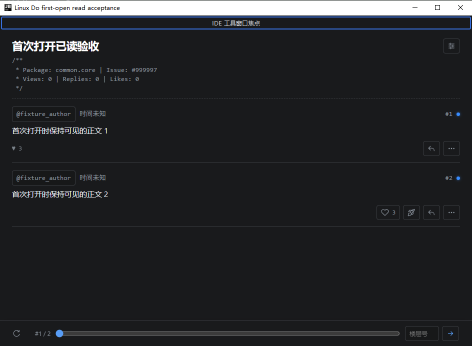
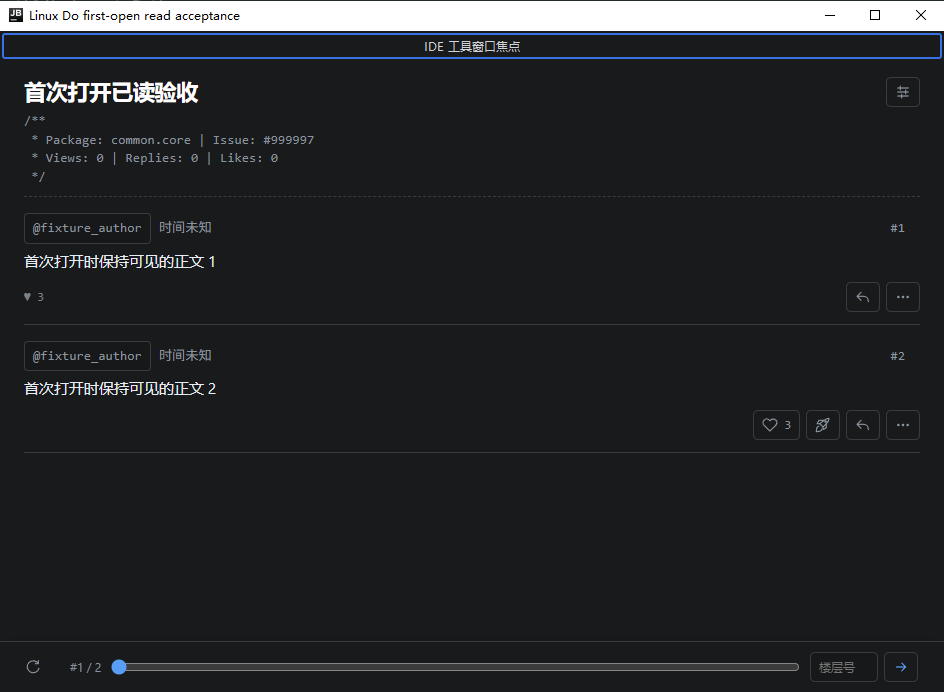

# 楼层号与未读标记布局验收

2026-10-03，发布版本统一为 1.0.2；以下专项检查与截图来自发布前内部构建 1.0.4。最终 1.0.2 安装包的发布验证见 [发布记录](release-1.0.2.md)。

楼层标题左侧依次显示头像、用户名、回复对象及时间；楼层号和未读小蓝点移到右侧。未读标记使用固定 7 像素占位，变为已读后仍保留占位，避免用户名、楼层号和正文移动。窄窗口保留同一行左右布局，左侧信息按可用空间换行。

## 验证结果

- 正文主题与阅读功能相关桌面测试 36 项通过；插件构建与安装包结构验证通过。
- 浏览器布局检查 81 项通过，覆盖深浅主题及 360 像素窄窗口。对小蓝点消失前后的用户名、右侧楼层信息和正文边界逐项比较，坐标与尺寸变化小于 0.1 像素，页面没有横向溢出。见[布局检查记录](reference/right-floor-metadata-layout.json)。
- 实际 IntelliJ IDEA Ultimate / IU-262.10968.63 正文验收 60 项通过。确认初始未读标记位于标题右侧；首次打开并保持工具窗口输入焦点时，正常阅读会消除标记，无需切换页面；消除前后信息与正文位置保持不变。Boost、阅读同步、窗口缩放和导航相关检查同时通过。见[实际 IDE 检查记录](reference/right-floor-metadata-ide.txt)。

本轮话题、Boost 和计时请求均使用隔离内存传输，没有向真实论坛写入。截图来自实际 IDEA：

安装包：`build/distributions/linuxdo-jetbrains-plugin-1.0.2.zip`。源码包：`build/delivery/linuxdo-jetbrains-plugin-1.0.2-source.zip`。在 IDEA「设置 → 插件 → 齿轮 → 从磁盘安装插件」选择安装包，并按提示重启。
